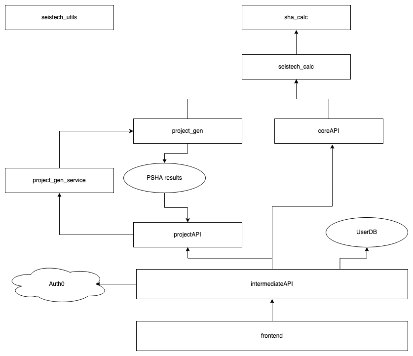

# Seistech

Note: This toolset is still under development, and is therefore not stable and changing frequently with no guarantee of backwards compatibility

The Seistech toolset consists of 4 components:

- Calculation
- Tools
- APIs
- Frontend

each of the components is briefly discussed below

Installation instructions for each package can be found in their respective READMEs

### Calculation

The core component that contains the calculation code, everything else builds on this. Is made up of two
packages: `sha_calc` contains the low level PSHA functions and `seistech_calc` which supports more complex PSHA
calculation. Such as hazard, disaggregation and UHS for logic trees (referred to as Ensembles).

Note: `seistech_calc` can be used directly, see its README for details

## Tools

This component consists of three packages: `seistech_utils` which contains utility functions that are shared
across all other packages, `project_gen` which allows generation of (static) PSHA results for a specific set of locations
and `project_gen_service` which is a service for generating projects (not fully functional at this stage).

### APIs

Consists of 3 APIs.

- The `core_api` which computes PSHA results on the fly (using `seistech_calc`)
- The `project_api` which returns static PSHA results (generated via `project_gen`)
- The `intermediate_api` is an extra layer between the frontend and core/project APIs to forward requests and responses.

### Frontend

The web application to provide a better user experience with data visualization for both computed PSHA results (using `core_api`) and static PSHA results (using `project_api`)

## Overview diagram

